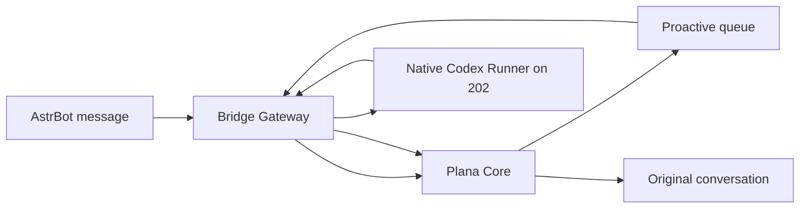

# Plana Bridge Gateway Architecture

## 定位

Bridge Gateway 是传输层，不是第二个执行中枢。Core 拥有对话、领域选择、确认、审计和任务状态；领域插件拥有业务查询与写入；202 原生 Codex Runner 是唯一复杂执行器。

## 模块边界

- `bridge/runtime.py`：插件装配、HTTP API、消息入口和生命周期。
- `bridge/core_inprocess.py`：优先调用同进程 Core，必要时使用 loopback fallback。
- `bridge/codex_relay.py`：Codex v1 提交、轮询、取消和 artifact 下载。
- `bridge/proactive_loop.py` / `bridge/proactive_runtime.py`：领取、投递和回写 proactive task。
- `bridge/idempotency.py`：终态、artifact 和通知阶段的幂等账本。
- `bridge/filters.py`：活动实例与消息过滤器守卫。
- `bridge/channel_contract.md`：外部消息归一化与传输约束。

Bridge 不包含 adapter registry、credential store、领域工具或 delegate v2 action envelope。

## 数据流

领域请求不经过 Bridge 本地执行。Core 每次最多选择一个 ANI-RSS、NCQQ 或 Komga 插件入口；插件直接返回只读结果或受控 proposal。复杂任务由 Core 生成 Codex proposal，用户确认后进入 proactive queue。

## Codex Contract

- contract：`plana.codex.runner.v1`
- `POST /plana/codex/delegate`
- `GET /plana/codex/result/{run_id}`
- `POST /plana/codex/cancel/{run_id}`
- `GET /plana/codex/artifact/{run_id}/{artifact_id}`

Bridge 只接受 delegate version 1。Runner URL 在 `lan_allowlist` 策略下必须是 loopback 或私网地址。提交、轮询、callback、artifact、终态和通知分别保持幂等，通知失败不能反转已持久化终态。

## 生命周期与安全

- disabled 时不启动 session、web handler 后续逻辑或 proactive loop。
- terminate 时先清除活动实例，再停止 loop，最后关闭 HTTP session。
- Runner ingress 仅接受 loopback 或配置的 Runner 主机。
- external gateway 和 active-send 使用独立 token。
- 日志不得输出 token、cookie、凭据或完整业务 payload。
- Bridge 不执行 shell、不审批 proposal、不安装 workflow/skill、不写领域数据。

## 维护规则

- 新增 transport contract 时同步更新 Core、Bridge 文档和静态门禁。
- 任何领域能力必须进入独立领域插件，不得回填 Bridge adapter。
- 任何复杂执行只能进入原生 Codex Runner，不得新增本地 command backend。
- 历史 Hermes、delegate v2 和 credential adapter 仅保存在离线归档，不提供在线兼容入口。
