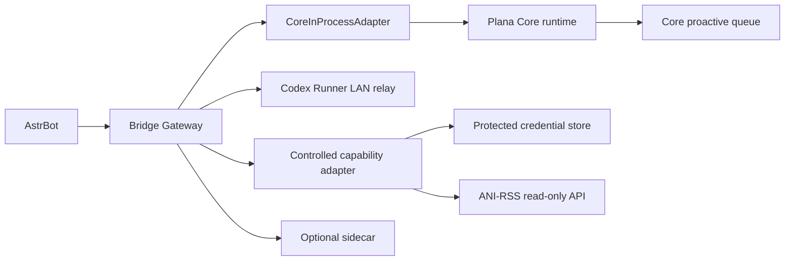

# Plana Bridge Gateway 架构

## Result Presentation

Bridge may pass completed structured results to the loopback-only Plana Renderer Service. Rendering and image delivery failures retain the existing text notification, while artifact transfer remains owned by Bridge.

Codex completion delivery is anchored by the Core-owned `plana.delivery.v1` contract. Bridge persists the normalized result through Core and records the Core-owned notification outcome; it does not independently deliver Runner results to AstrBot sessions.

Bridge Gateway 是 Plana 插件族的内网桥接层。它让 Core 保持 AstrBot 内嵌中枢定位：
Core 负责记忆、任务入口、确认、审计和受控任务级 Skill 选择；Bridge 只负责同进程
Core 调用、外部 sidecar 适配、主动发送入口和 Codex Runner relay。

## 模块边界

- `bridge/runtime.py`: AstrBot 生命周期、HTTP 调试端点、事件转发和 Core/Runner 调用装配。
- `bridge/channel_contract.md`: 外部通道、MCP discovery、匿名 session、rate limit 和 capability downgrade 规则。
- `bridge/core_inprocess.py`: 同进程 Core adapter，优先读取 active Core plugin/runtime。
- `bridge/codex_relay.py`: Codex Runner relay，并发提交 `codex_delegate` payload，返回结构化投递结果。
- `bridge/idempotency.py`: SQLite 终态 ledger，拒绝冲突终态并持久记录通知是否完成。
- `bridge/credential.py`: `CredentialProvider` 接口与本地加密凭据实现。
- `bridge/capability.py`: delegate v2 action envelope 验证和 capability allowlist。
- `bridge/adapters/ani_rss.py`: 固定 ANI-RSS `/listAni` 只读调用；在 adapter 内解析 `credential_ref`.
- `bridge/adapters/ncqq.py`: 固定 NCQQ 公开实例快照，只提供实例列表和登录状态。
- `bridge/adapters/qbittorrent.py`: 固定 qBittorrent 列表与传输状态接口，删除路径和 tracker 等敏感字段。
- `bridge/adapter_registry.py`: 按配置装配本地 capability allowlist，入口不包含业务执行逻辑。
- Komga 领域 descriptor、proposal facade 和 `komga_manager` 工具归独立 Komga 插件所有；Bridge 不注册 `komga_plugin` profile，防止重复领域发现和工具冲突。
- Bridge 仅保留默认关闭的 Komga legacy adapter shim，为旧 external delegate v2 contract 提供书库列表、系列搜索和最近内容三个只读 capability；不提供任何写 capability。
- `scripts/import_ani_rss_credential.py`: 从旧 ANI-RSS JSON 仅导入 `api_key`，不输出 secret、不删除源文件。
- `bridge/proactive_delivery.py`: proactive task 分流，Codex 任务走 Runner，其它任务可走 sidecar。
- `bridge/proactive_loop.py`: 自动 poll Core proactive 队列，并按成功/失败回写 delivered/retry。
- `bridge/proactive_runtime.py`: proactive 调试端点、Codex result ingress 和 Core mark delivered/failed fallback。
- `plugin/config.py`: 配置读取与旧配置兼容。

## 数据流

Bridge 正常不通过 `/api/plug` 调 Core。它会在进程内定时领取 Core proactive 队列，
把 Codex 委派按 `interactive`、`long`、`high_isolation`、`import` lane 转发给 Runner。
投递成功写回 `delivered` 和 `runner_run_id`；投递失败写回 `retry_pending/last_error`，
不会让 ready 任务永久卡住。只有 active Core plugin 不可用时，才使用 `core_*_url`
作为调试 fallback。fallback 可能受 AstrBot 外层鉴权影响，不是生产主路径。

Runner 返回 4xx 时，relay 解析结构化错误并保留 lane；`lane_disabled` 会明确回写失败。
结果取得有两种互斥路径：配置了可用 callback 时由 Runner 终态回调；未配置时由
Bridge 轮询，轮询窗口至少覆盖 Runner 的 120 秒默认超时。轮询中的
`queued/running/cancelling` 只在 `event_seq` 或心跳变化时转成 Core
`execution_observation`，不进入终态 ledger、不触发消息通知或 workflow resume。终态通过 Core
`result_report` 持久化后，Bridge 才向原 UMO 主动发送摘要和 artifact 元数据；发送失败
只记录日志，不改变 Core 终态。

Codex Runner lifecycle 由 202 产生，Bridge 不自行推断：每次实际执行具有 `attempt_id`，
`event_seq` 单调增长，5 秒心跳续租 20 秒；取消分别记录 requested、acknowledged 和
terminal 时间。Bridge 仅负责去除重复轮询观测并转发，Core 负责租约过期解释、审计和治理。

Codex 终态使用 runner run id、显式 idempotency key 或 request id 作为稳定键。相同终态与 payload digest 重放直接返回已处理状态；同一键出现不同终态或不同 digest 时拒绝为 `terminal_result_conflict`。通知成功状态写入本地 ledger，Bridge 重启后不会重复处理已确认通知。

## 安全边界

- 公网入口只由 AstrBot 提供；Bridge 默认不是公网服务。
- `internal_lan_mode=true` 时，Bridge HTTP 调试端点只接受本机回环请求或显式 token。
- `external_gateway_mode=true` 时才要求 `api_token` 保护 Bridge HTTP API。
- Codex Runner 默认 `runner_access_policy=lan_allowlist`，只允许 loopback/private LAN URL。
- Runner result ingress 只接受 loopback 或 `codex_runner_url` 中配置的 Runner 主机。
- AstrBot Dashboard `/api/plug/*` 仍可能在插件路由前要求 JWT；不能把受该外层保护的 URL 当作无凭据 Runner callback。当前 201/202 部署显式关闭 callback 并使用轮询。
- Runner 主机应通过防火墙只放行 Astr/Core/Bridge 主机访问，例如 202 只允许 201 访问 8766。
- `active_send_token` 仍独立保护主动发送 API，因为它可能影响真实聊天会话。

## 维护规则

- 新的 Core payload kind 必须同时更新 Core、Bridge 文档和检查脚本。
- 新外部通道和 MCP discovery 必须先落到 normalized channel contract，再映射回 Core 既有 bridge kind、capability registry、confirmation gate 和 audit。
- Codex relay 不得执行 shell、审批 proposal、安装 skill/workflow 或写 Core storage。
- delegate v1 保持原 Runner relay；delegate v2 必须通过 `ActionEnvelope` 和本地 capability registry，并以 `(service_ref, capability)` 联合匹配，未知或错配组合 fail-closed。
- Bridge adapter 已直接产出终态的 v2 delivery 标记为 `result_finalized`；proactive queue 仍标记 delivered，但不得再把 Core remote run 从 succeeded 降回 submitted。v1 Runner relay 状态机不变。
- 本地 v2 adapter 结果带 `suppress_notification=true`：Bridge 仍先提交 Core `result_report` 持久化，但不再主动发送重复消息；同步回复由 Core 负责。v1 Runner 结果通知保持原行为。
- v2 action 不能携带任意 URL、method、headers、body 或原始 secret；只允许 adapter 声明的参数和 `credential_ref`。
- ANI-RSS adapter 首版仅允许 `enabled`、`limit` 参数，固定 POST `/listAni`，且目标必须是 loopback/private IP。
- ANI-RSS 响应必须在 adapter 边界投影为紧凑用户字段；不得把路径、URL、凭据、规则或完整订阅 raw object 写入 Core result JSON。
- Windows 凭据主密钥由当前用户 DPAPI 保护；Linux 主密钥依赖 0700 目录和 0600 文件权限；数据文件使用标准库 HMAC-SHA256 派生密钥流并做 encrypt-then-MAC 认证，不增加插件硬依赖。
- Runner 回传的 workflow/skill 草案只能作为 Core result report 的审计 artifact，不能自动安装或扩展 Core capability。
- 网络失败必须返回明确错误，不得伪装为空结果。
