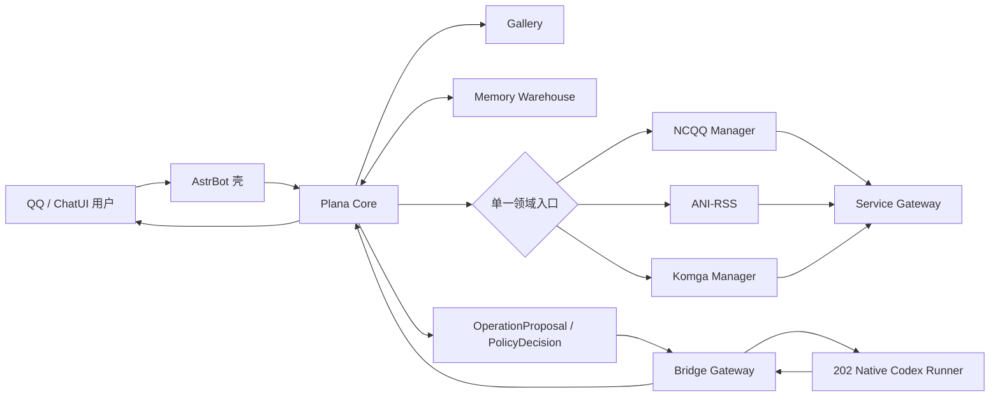

# Plana Core Architecture

## 定位

Plana Core 是陪伴与治理中枢，不是通用插件执行器。Core 维护对话身份、Persona、关系、记忆策略、领域路由、操作评审、确认账本和结果交付；业务语义归领域插件，复杂执行归原生 Codex Runner。

## 组件图

## 请求边界

### 陪伴聊天

普通聊天只使用 Persona、关系、对话账本和自动记忆召回。Core 不为普通聊天挂载执行工具。显式记忆检索可以请求级挂载 Recall；显式 Web 搜索可以临时挂载受控搜索工具。

### 领域插件

`dialogue/tool_policy.py` 根据自然语言选择一个 profile：NCQQ、ANI-RSS 或 Komga。单次请求只能得到一个领域入口，模型不能同时看到全部插件能力。领域插件负责实体解析、实例选择、只读执行和写 proposal 生成。

领域插件不是两个版本或两套代码。每个领域插件使用同一仓库的 `main`（公开分支）与 `codex/core-governed` 分支：前者保持独立 AstrBot 使用，后者增加 Plana 接管。两条分支共享业务内核，差异严格限定为 descriptor、proposal/lease adapter、确认接线与通知接线。

### 写操作

写操作必须携带明确资源范围，进入 Core 的 proposal、policy、lease 和确认账本。模型不能确认自身 proposal、扩大 `write_scope` 或绕过领域插件权限。取消和过期必须阻止执行。

### 复杂执行

浏览器自动化、多页调查、代码修改、日志深度诊断和长任务由 Core 自动生成 Codex proposal。模型只描述目标和风险；Core 编译受控 bundle，Bridge 转发，Runner 校验 task skill 名称、路径、SHA-256、资源范围和租约。

## Codex Contract

Bridge 只使用 `plana.codex.runner.v1`：

- `POST /plana/codex/delegate`
- `GET /plana/codex/result/{run_id}`
- `POST /plana/codex/cancel/{run_id}`
- `GET /plana/codex/artifact/{run_id}/{artifact_id}`

Bridge 不执行任务、不审批 proposal、不获得 shell 权限。Runner LAN allowlist 只允许 201 和 loopback。Runner 地址、lane、timeout、callback 与鉴权属于 Bridge 配置，不进入模型 prompt。

## Task Skill

运行时不建设 Skill Center。允许的 task skill 来自版本控制仓库和固定 allowlist。Runner 校验文件路径与 SHA-256，仅在单次任务的 `.agents/skills` 中物化，任务终态后清理。Codex 生成的复用建议只作为 artifact 或离线审计记录，不能从 Dashboard 批准并动态加载。

## Memory Warehouse

Memory Warehouse 保持独立插件与 `memory_warehouse.sqlite3`，contract 为 `plana.memory_warehouse.v1`。

- Core：采集、裁剪、脱敏、结构化、画像快照和写入决策。
- Warehouse：evidence、稳定 ID、FTS、备份和保留策略。
- 同进程优先 sibling `core_service`；分进程使用 loopback HTTP 和独立 service key。
- Warehouse 不监听普通聊天、不注册 LLM 工具、不修改 Persona 或长期事实。

Dashboard 只显示 Warehouse 健康、事件数、索引状态和最近错误。

## Web

`web/routes.py` 注册 Dashboard 与插件页 bridge alias。六个主视图聚焦陪伴、Memory Warehouse 健康、领域插件动态 descriptor、TaskSession、Codex Runner、Adapter Gateway 和技术诊断。旧 Workflow、候选和本地任务队列端点已删除；历史资产只在离线归档中保留。

## Legacy 数据

`scripts/archive_retired_state.py` 对退役表和旧执行记录执行完整数据库备份、JSONL 导出、行数比对和 SHA-256 校验。只有校验完成后才删除活动表或旧执行行；当前 Codex、Memory、Persona、关系、资源治理和用户历史继续保留。Web 不再解释旧执行器记录。

## 生命周期

- `core.enabled=false`：不激活消息过滤器，不注册请求工具，不启动维护任务；Web 只返回 disabled 状态。
- 初始化成功后才发布 active plugin。
- 初始化异常统一回滚。
- 所有 Web handler 校验当前实例、disabled 与 terminating 状态。
- terminate 停止 `RuntimeJobManager` 并撤销仍保留的 Recall/Search 工具。

## 验收门禁

`python scripts/check_code_acceptance.py --tier code` 必须验证：

- Git 跟踪 Python compileall 与 Ruff `F401/F811/F821/F841`。
- Git 跟踪 JavaScript `node --check`。
- 生产代码不存在已退役 contract 或全局执行工具。
- 每次聊天最多挂载一个领域入口。
- Memory Warehouse contract 仍存在。
- Dashboard 领域、资源、远程任务与诊断装配完整。
- 文档引用和配置字段真实存在。
- 七个保留 AstrBot 插件的入口、metadata、handler 归属和依赖声明符合家族合规检查。
- `git diff --check` 通过。

201/202 的真实 Runner 生命周期、领域读取、写入沙箱和 Matcha 自然语言回归属于 integration/live 层，不混入离线 code 门禁。

## 退役组件

Workflow Center、Skill Center、TTS、Hermes Agent 和 Plana Hermes Adapter 已退出生产架构。各仓库保留 Git 历史和数据归档，但入口无副作用，201 不再加载对应插件，202 不再运行相关进程。
