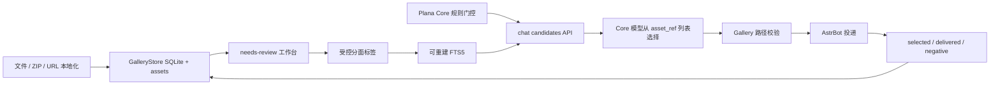

# Plana Gallery Architecture

## Role

Gallery 是独立的本地图片资产与聊天候选服务。它拥有图片文件、SQLite metadata、审核、标签体系、FTS 派生索引和使用反馈。Core 负责聊天参与、门控、模型受控选择和最终投递，不直接读写 Gallery 数据库。

## Runtime

## Module Boundaries

- `main.py`：AstrBot 薄入口。
- `plugin/runtime.py`：生命周期、Web API 注册、鉴权和模块装配。
- `plugin/chat_service.py`：Core-facing candidates、feedback、resolve 和 status 的唯一业务入口。
- `plugin/chat_server.py`：可选的 Core 专用 loopback HTTP，固定绑定 `127.0.0.1` 并校验 `X-Plana-Core-Key`。
- `plugin/chat_api.py`：AstrBot Dashboard 路由适配器，复用 `chat_service`，不承载候选业务逻辑。
- `plugin/management_api.py`：缩略图、诊断、标签定义/合并和后台任务管理接口。
- `plugin/ingest.py`：文件、目录、ZIP、URL 本地化导入。
- `plugin/tagging.py`：审核候选、批量标签和 AI/VLM 建议边界。
- `assets/store.py`：资产 CRUD、hash 去重、分页和文件事务。
- `assets/query.py`：资产解析、兼容游标分页、页码分页、多标签组合筛选和随机选择。
- `assets/schema.py`：幂等 schema v5、标签定义、别名、FTS 和迁移。
- `assets/tag_governance.py`：后端权威旧标签治理矩阵，定义自动归一、逐图拆分、场景复核和保留边界。
- `assets/governance.py`：治理计划、幂等批次、逐资产审计和非破坏性规范标签追加。
- `assets/emotions.py`：逐资产多情绪、独立强度、主次约束和旧强度标签兼容投影。
- `assets/transactions.py`：原子审核提交、乐观锁和两阶段标签合并令牌。
- `assets/serialization.py`：资产行到管理 API payload 的稳定投影。
- `assets/chat_search.py`：生产 eligibility、候选排序、反馈和路径 guard。
- `assets/derivatives.py`：WebP 缩略图派生表、SQLite 任务队列、任务恢复和文件清理。
- `assets/lifecycle.py`：审核审计、旧候选反馈和 tombstone。
- `remote/mappings.py`：仅保留旧 remote mapping 的只读兼容查询。
- `web/frontend/`：Vue 3 + TypeScript 管理端源码，按视图、组件、composable 和 API client 拆分。
- `web/dist/index.html`：Vite 单文件构建产物，由 AstrBot 直接提供，不产生生产 Node.js 依赖。
- `web/page.py`：薄 HTML 入口，仅加载构建产物并注入 API base。

入口、页面、存储和命令文件接近 500 行时必须按职责继续拆分。

## Core Transport

同进程是默认路径：Core 通过 AstrBot 插件注册表发现 Gallery 插件实例，只取得显式暴露的 `chat_service`。这样绕开 Dashboard `/api/plug/*` 的用户 JWT 中间件，同时保持 Core 不接触 Gallery Store 或 SQLite。

分进程时可显式开启 `core_service_http_enabled`。服务固定监听 `127.0.0.1:6193`，要求 `X-Plana-Core-Key` 与 `core_service_key` 常量时间匹配，并限制请求体大小。Core 侧 URL 为 `http://127.0.0.1:6193/plana_gallery`，且必须配置相同的 `plana_core_service_key`。该通道不接受代理、公网或 Dashboard API 路径；跨主机部署需要独立网关协议。

## Canonical Data

事实数据：

- `gallery_assets`
- 本地 `assets/` 文件
- `gallery_asset_tags`
- `gallery_tag_definitions`
- `gallery_tag_aliases`
- `gallery_review_audit`
- `gallery_asset_tombstones`
- `gallery_candidate_events`

兼容或派生数据：

- `gallery_assets.tags` 是兼容投影，规范检索使用 `gallery_asset_tags`。
- `gallery_assets_fts` 可以重建，不决定审核或资产身份。
- `gallery_remote_assets` 是旧版本只读兼容数据，新运行时不写入。

连接启用 foreign keys、WAL 和 busy timeout。文件写入失败不得留下数据库记录，数据库写入失败不得留下孤儿文件。

## Tag Policy

规范分面为：

- `emotion:*`
- `tone:*`
- `scene:*`
- `role:*`
- `intensity:1..3`
- `safety:safe|restricted`

原有自由标签是长期兼容数据，继续用于搜索、筛选、命令和逐图整理，不要求批量迁移为受控分面。新增分面用于聊天检索增强；别名只归一已定义的同义词，不删除未知旧标签。

`gallery_asset_tags` 继续表达“图片属于哪些情绪/语气/场景”，并保持所有旧数据和筛选兼容。`gallery_asset_emotions` 单独表达每个 `emotion:*` 在该图片中的 `intensity=1..3`、`prominence=primary|secondary`、来源和可选建议置信度。一张图片可有多个情绪，但最多一个主情绪。标签修改与情绪 profile 修改在同一事务内完成；移除情绪标签时必须同时移除对应 profile。schema v5 增加 `gallery_tag_governance_batches` 与 `gallery_tag_governance_audit`，使旧标签治理可追踪、可重放且不会重复产生审计事件。

旧 `intensity:1..3` 不是逐情绪事实源。schema v4 初始化时会将已有 `emotion:* + intensity:*` 幂等回填为情绪 profile；后续写入则把所有 profile 的最大强度投影回单个 `intensity:*`，供旧命令、旧筛选和未升级客户端读取。AI 建议置信度不得复用 `intensity` 字段。

默认情绪规范采用面向聊天反应图的精简集合，而不是完整心理学本体。覆盖积极与亲近、意外与不确定、社交与自我意识、失落与对抗、低能量状态五组；新标签通过幂等 seed 增量加入，已有自由标签只在人工确认后合并。`emotion:comfort` 为兼容键，语义定义为关怀/安慰回应倾向。

新导入且无标签的图片使用 `needs-review`。生产候选必须同时满足：

1. 不含 `needs-review`。
2. 含 `safety:safe`。
3. 不含 `safety:restricted`。
4. 文件存在并位于 Gallery 管理目录内。

普通标签编辑和 AI/VLM 建议都不能直接改变 production eligibility。只有显式人工“确认通过”动作可以移除 `needs-review` 并进入安全候选。

群聊图片采集由 `enable_silent_chat_image_collection` 单独控制，默认关闭。开启后事件处理器仅在群聊和可选 scope allowlist 内静默工作，不产生回复、不调用 Core，也不停止原消息事件。采集先执行字节、像素、GIF 帧数、协议和 MIME 校验，再以 SHA-256 查询现有资产及 tombstone；新资产进入 `needs-review`，重复资产仅写入脱敏观察事件。`gallery_chat_collection_events` 只保存哈希化 scope、sender、message 标识、稳定引用、结果和时间，并按 30 天清理。

## Candidate Contract

`plana.gallery.candidates.v1` 请求包含 request ID、query、受控 facets、排除 refs 和 limit。可选 `emotions` 字段提供 `emotion_tag`、`target_intensity`、`prominence=primary|secondary` 和权重；主目标按显式 prominence 识别，不依赖数组位置，省略字段时保持原 facet 行为。响应只返回候选 metadata：`asset_ref`、caption、tags、emotions、matched emotions、score、score breakdown、review 和 safety 状态。

排序顺序：

1. 精确 canonical facet 与多情绪覆盖。
2. 逐情绪强度匹配与显式主目标的主情绪对齐。
3. 强冲突额外情绪惩罚；与主目标正负方向相反且强度为 3 时降权，弱次情绪和请求内复合情绪不处罚。
4. alias 归一后的 facet。
5. FTS title/caption/tag/alias。
6. delivered/selected/negative/failed 显式反馈。
7. 七日内重复惩罚。
8. request ID 驱动的小幅稳定扰动。

模型不能提交任意路径或 URL。Core 选定 `asset_ref` 后必须再次调用 resolve；Gallery 仅返回位于管理根目录内的有效文件。

## Feedback

`gallery_candidate_events.event_id` 是幂等键。同一聊天请求可以依次记录 selected 和 delivered；只有 AstrBot 实际发送成功后才写 delivered。失败 resolve 或发送写 failed，不影响文本回复。

反馈只影响排序，不自动修改标签、审核或安全级别。生产 Core 将兼容 `query` 字段置空，只提交规范化情绪摘要，Gallery 不依赖或持久化原始聊天文本。

## Web

Dashboard 保留四个一级入口：资产整理、待审核、标签体系、检索诊断。资产整理继续承载旧版的路径导入、批量上传、标题、caption、自由标签、搜索和逐图编辑；待审核与检索诊断是叠加能力，不替换原工作流。情绪编辑器提供逐情绪轻/中/强对照示例，并对多个强情绪或强烈正负情绪并存给出非阻断提示。生产标签体系只展示正式标签定义、说明、别名和实际使用量；覆盖评测、回放样本和 fixture 统计留在离线脚本中。诊断请求与 Core 共用相同的结构化情绪字段，避免 Web 预览与生产排序出现契约漂移。

管理端采用页码分页，支持 24、48、72、96 张每页和多个标签的 all/any 组合筛选；旧 API 调用仍可使用游标分页。标签编辑按情绪、语气、场景和实际内容标签组织，可按稳定键、显示名称、说明和别名检索。自由标签创建前先检查现有标签和别名，并经过二次确认。

网格只加载 320/640px WebP 缩略图并使用浏览器 lazy loading；详情抽屉才读取原图。缩略图缺失时 HTTP 请求只排队并返回占位图，不在 Quart 事件循环同步执行 Pillow。后台任务最多重试三次，使用 5/30/120 秒退避；超过十分钟的 `running` 任务在启动时恢复，成功记录保留七天、失败记录保留三十天。

审核页通过 `/api/review/commit` 在单事务内保存逐图建议、批量标签和可选人工通过状态；任一资产版本冲突时整批回滚。标签定义写入会拒绝占用其他规范键或已归属别名。旧标签治理只允许确定性归一：唯一目标直接替换，已有人工分类时移除旧标签，仍无法确定的资产加入 `needs-review`；管理端不提供自由标签批量映射。管理端选择始终限定当前页，翻页或修改筛选后自动清空。

## Compatibility

旧 semantic candidate API 保留一个兼容周期，但 Core 新代码只调用 `/api/chat/*`。旧 remote mapping 表暂不删除，迁移只停止写入并提供导出说明。

## Verification

- `scripts/check_gallery_beta.py`：schema、契约、Web、审核、反馈和路径生命周期。
- `scripts/benchmark_local_candidates.py`：20,000 条 metadata 的 SQLite/FTS 候选基准。
- `scripts/run_gallery_web_preview.py`：只读开发预览服务；读取现有情绪 profile，并投影 v5 标签定义、治理规则、别名和诊断兼容关系，不执行 schema 初始化或写操作。
- `scripts/govern_legacy_gallery_tags.py`：旧标签治理 dry-run/apply 工具；可在写入前创建 SQLite 备份、资产 SHA-256 清单和迁移报告。
- `scripts/apply_gallery_visual_classification.py`：全库视觉情绪分类导入器；校验稳定引用、主次情绪和 1–3 强度，只替换情绪及强度投影，不修改角色、语气、场景或旧自由标签。
- `scripts/apply_gallery_consensus_review.py`：争议素材多档复核合并器；按输入顺序将最后一份审慎结果作为多数分歧裁决，只有主情绪多数一致、审慎档支持且强度跨度不超过一级时才写回，并始终保留人工审核标记。
- `scripts/finalize_gallery_review_queue.py`：审核队列收口工具；使用完整分类清单和多档共识报告推导最终人工集合，备份后只同步 `needs-review`，避免旧治理标记长期占用待审核队列。
- `scripts/finalize_gallery_release_data.py`：正式数据收口工具；归一复核来源名、修正待审核安全投影，并通过外部人工清单补充逐图情绪与强度，写入前生成数据库和资产清单备份。
- `web/frontend`：`npm run test`、`npm run build`。
- `python -m compileall -q .`
- `git diff --check`
